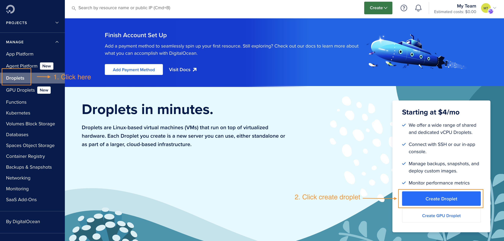
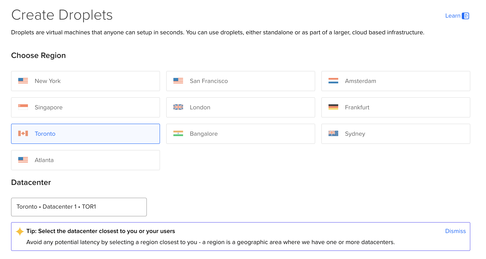
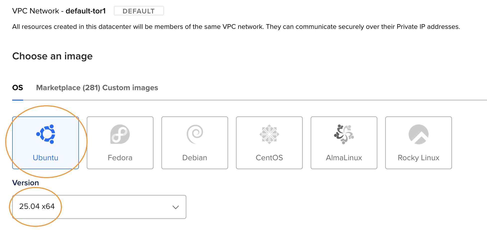
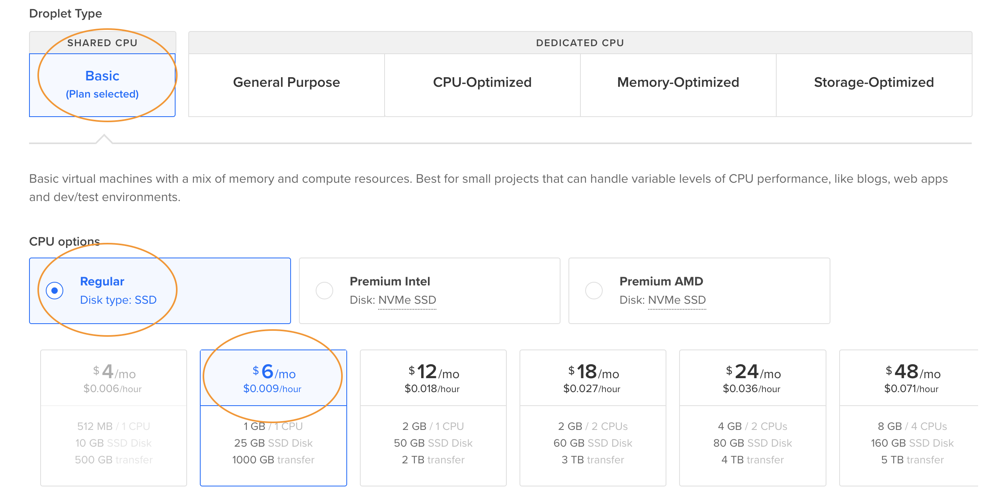
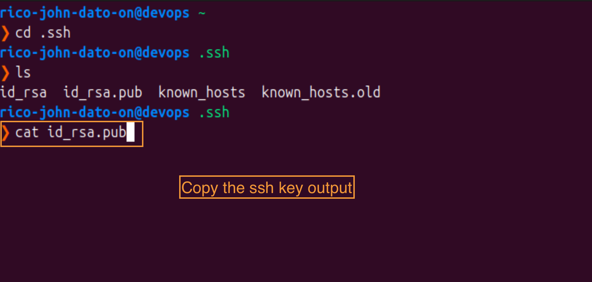
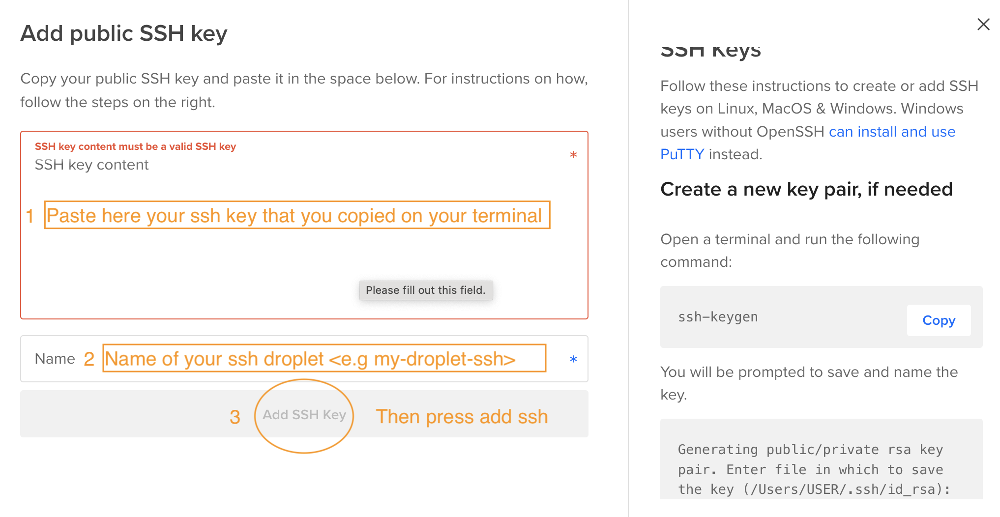
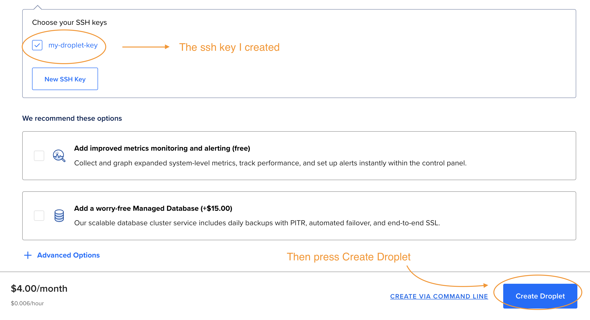
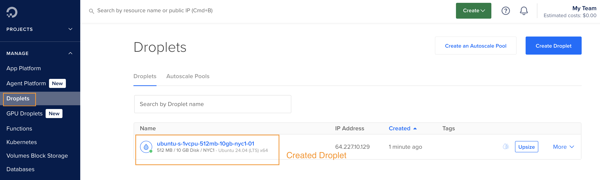
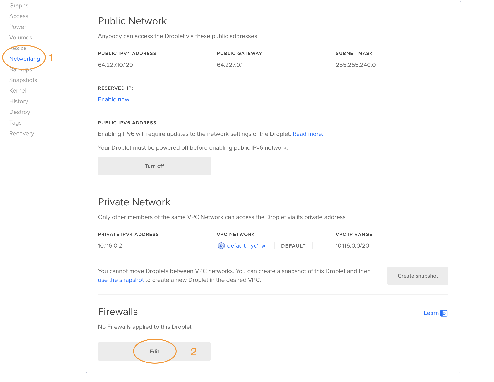
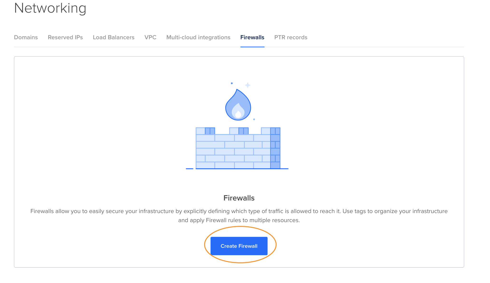

# README.md

# 🌐 DigitalOcean Ubuntu Server Setup Guide

Welcome to this step-by-step guide to setting up a **Linux Ubuntu server (Droplet)** on [DigitalOcean](https://www.digitalocean.com/). This guide will walk you through:

- 🔧 Creating a droplet
- 🔐 Setting up SSH key authentication
- 🛡️ Configuring firewall rules
- 🖥️ Accessing your droplet via SSH
- ☕ Installing Java (JDK 8)

---

## 📋 Prerequisites

- ✅ A [DigitalOcean account](https://www.digitalocean.com/)
  - New users get free credits 💸
- ✅ Basic familiarity with command line (Linux/Mac/WSL)
- ✅ SSH client installed (most systems already have it)

---

## 🚀 Create a Droplet

1. **Log in to DigitalOcean**
2. Click **“Create”** → **“Droplet”**



3. Select:

- Region closest to your location 🌍



- **Ubuntu** as the OS



- **Basic plan** (smallest one is enough for demo)



4. Under **Authentication**:

- Choose **SSH Key**


- On your local machine go to your terminal and copy the command below

```bash
cat id_rsa.pub
```



- then paste it to the digital ocean



- then press "Add SSH Key" to continue and press Create Droplet



- Go to Droplets to see created droplet



## 🔐 Secure the Droplet with a Firewall

By default, all ports are open—not secure! Let’s fix that.

1. Click the created droplet and go to the Networking tab



2. Create a new firewall



- Name: my-droplet-firewall
- Allow Inbound Rules:
  - SSH (port 22) from your IP (not all IPs!)
  - Use What’s My IP to find your current IP

3. Assign the firewall to your droplet.

### 🔥 Firewall Rules Summary

| Type     | Port | Source       | Description             |
| :------- | :--- | :----------- | :---------------------- |
| Inbound  | 22   | Your IP only | SSH access to server    |
| Outbound | All  | All          | Allow droplet to update |

## 🔌 Connect via SSH

```bash
ssh root@<your-droplet-ip>
```

- Because of the SSH key, no password is needed. You're now logged in as the root user 🎉
